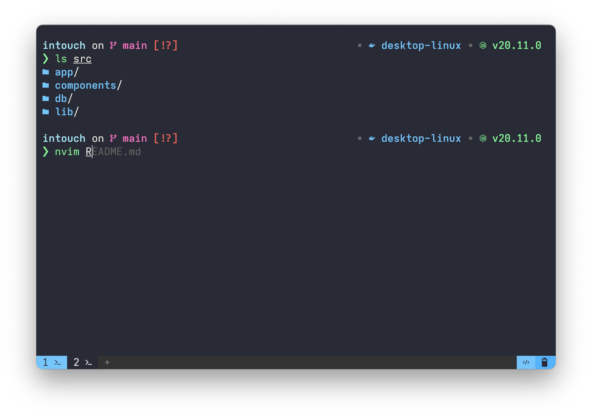

# dotfiles

These dotfiles are designed to strike a good balance between minimalism and great features. 

## ⚡Getting Started

I manage my dotfiles using `chezmoi`. Setting up a new machine can be done by [running one line](https://www.chezmoi.io/quick-start/#set-up-a-new-machine-with-a-single-command).

For my complete setup read [My clean and simple terminal setup](https://ratoru.com/blog/terminal).

## 🔨 Featured Tools

### Config Files

- [chezmoi](https://www.chezmoi.io/) for dotfile management.
- [nvim](./dot_config/nvim/) as primary editor. Configured using `kickstart`.
- [yazi](https://yazi-rs.github.io/) as terminal file manager. Also evaluating [broot](https://github.com/Canop/broot) as an alternative.
- [bat](https://github.com/sharkdp/bat) as `cat` replacement.

### Mentioned in `.zshrc`

- [zoxide](https://github.com/ajeetdsouza/zoxide) for jumping around using `z`.
- [eza](https://github.com/eza-community/eza) as `ls` replacement.
- [fzf](https://github.com/junegunn/fzf) as a fuzzy finder.
- [lazygit](https://github.com/jesseduffield/lazygit) as a simple terminal UI for git commands.
- [lazydocker](https://github.com/jesseduffield/lazydocker) as a simple terminal UI for docker commands.
- [Starship](https://starship.rs/) as shell prompt.
- [zsh-autosuggestions](https://github.com/zsh-users/zsh-autosuggestions)
- [zsh-syntax-highlighting](https://github.com/zsh-users/zsh-syntax-highlighting)

### Fonts & Themes

- [Meslo Nerd Font](https://github.com/romkatv/powerlevel10k/blob/master/font.md) or [Iosevka](https://github.com/be5invis/Iosevka/tree/v30.3.3). To use Iosevka, go to the repo, pick the font variant you like (e.g. SS14), and download the term variant. In iTerm pick the Extended variant and use a Nerd Font like Meslo for non ascii characters.
- [Snazzy Terminal Theme](https://github.com/sindresorhus/iterm2-snazzy)

### Environments

- [pyenv](https://github.com/pyenv/pyenv) and [uv](https://github.com/astral-sh/uv) for Python.
- [fnm](https://github.com/Schniz/fnm) for Node.js.

## Docker Apps

- [Glance](https://github.com/glanceapp/glance) as a simple website overview.
- [Maybe](https://github.com/maybe-finance/maybe) as a finance tracker.

