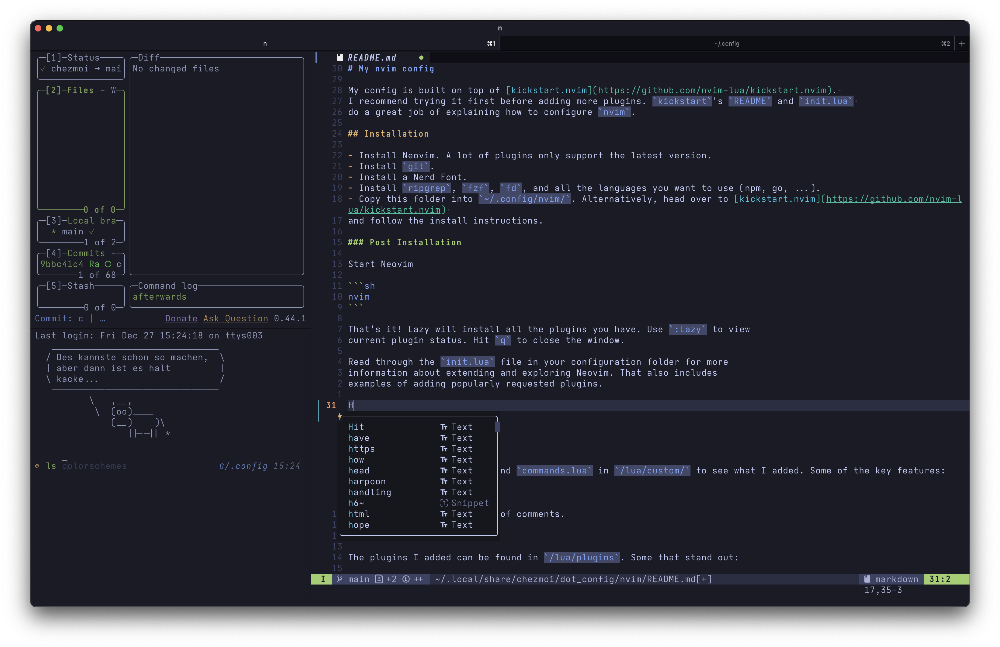

# dotfiles

These dotfiles are designed to strike a good balance between minimalism and great features.

## ⚡Getting Started

I manage my dotfiles using `chezmoi`. Setting up a new machine can be done by [running one line](https://www.chezmoi.io/quick-start/#set-up-a-new-machine-with-a-single-command).

For my complete setup read [My clean and simple terminal setup](https://ratoru.com/blog/terminal).

## 🔨 Featured Tools

> [!NOTE]
> While a lot of these tools will be useful to you out of the box,
> I highly recommend reading the respective docs and watching a showcase.

### Config Files

- [chezmoi](https://www.chezmoi.io/) for dotfile management.
- [nvim](./dot_config/nvim/) as primary editor. Configured using `kickstart`.
- [ghostty](./dot_config/ghostty/) as a configurable, cross-platform terminal. I added support for changing the font and theme on the fly.
- [yazi](https://yazi-rs.github.io/) as terminal file manager. Also evaluating [broot](https://github.com/Canop/broot) as an alternative.
- [bat](https://github.com/sharkdp/bat) as `cat` replacement.

### Mentioned in `.zshrc`

- [zoxide](https://github.com/ajeetdsouza/zoxide) for jumping around using `z`.
- [eza](https://github.com/eza-community/eza) as `ls` replacement.
- [fzf](https://github.com/junegunn/fzf) as a fuzzy finder.
- [jq](https://github.com/jqlang/jq) as a JSON processor.
- [lazygit](https://github.com/jesseduffield/lazygit) as a simple terminal UI for git commands.
- [lazydocker](https://github.com/jesseduffield/lazydocker) as a simple terminal UI for docker commands.
- [Starship](https://starship.rs/) as shell prompt.
- [zsh-autosuggestions](https://github.com/zsh-users/zsh-autosuggestions)
- [zsh-syntax-highlighting](https://github.com/zsh-users/zsh-syntax-highlighting)
- A lot of functions and aliases to make my life easier.

### Fonts

To make Neovim and some of the other CLI tools look good you will need a Nerdfont. Some terminals like Ghostty already have Nerdfont icons packaged. This means you will not need to patch your fonts.

- [Iosevka](https://github.com/be5invis/Iosevka/tree/v30.3.3). To use Iosevka, go to the repo, pick the font variant you like (e.g. SS14), and download the term variant. In iTerm pick the Extended variant and use a Nerd Font like Meslo for non ascii characters.
- [Maple Mono](https://github.com/subframe7536/maple-font). This font is a lot more playful than Iosevka.
- [Meslo Nerd Font](https://github.com/romkatv/powerlevel10k/blob/master/font.md)

For note taking I am a big fan of [Atkinson Hyperlegible Next](https://www.brailleinstitute.org/about-us/news/braille-institute-launches-enhanced-atkinson-hyperlegible-font-to-make-reading-easier/).

### Themes

- Tokyonight
- GruvboxDarkHard
- [Snazzy Terminal Theme](https://github.com/sindresorhus/iterm2-snazzy)
- [Vague](https://github.com/vague2k/vague.nvim)

### Environments

- [uv](https://github.com/astral-sh/uv) for Python.
- [mise](https://mise.jdx.dev/) for Node.js and Go.

## MacOS Settings

I also included a small script that uses `default` to automatically configure my settings.
Read through [`.macos`](./executable_dot_macos) to see if you would like to use the same settings.

## Future changes

- Add AI chat assistant.
- Learn `tee` and [GNU parallel](https://blog.ronin.cloud/gnu-parallel/).
  - It's called tee because it makes a T. Data flows across the top of the T (from stdin to stdout), but also gets duplicated out the bottom (to a file).
