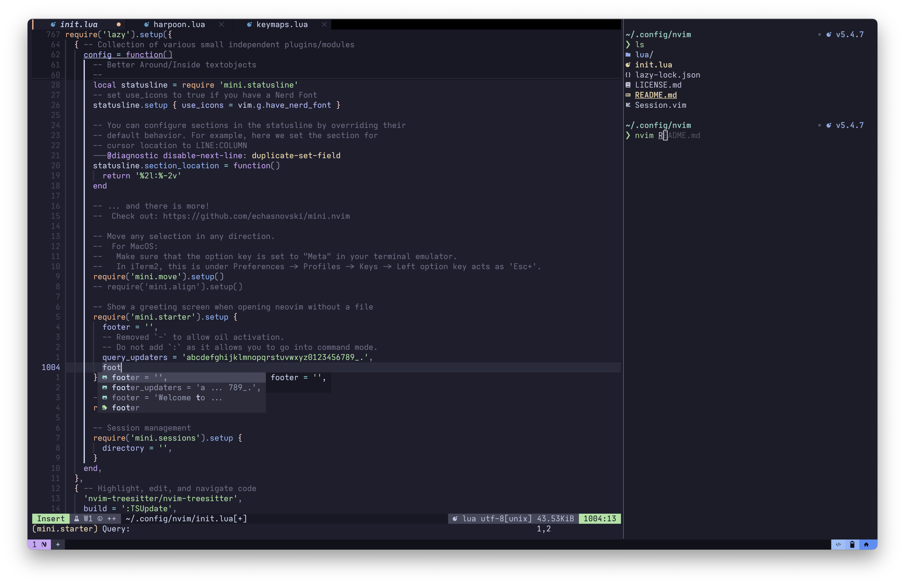

# Wezterm

Wezterm is an amazing terminal that is highly customizable. I especially
love that Wezterm supports the most important tmux features and I can write my own tab bar.

## Features

- Vim-like keybindings for tab and pane navigation.
- Fancy tab bar that shows a leader indicator, custom tab names, a water reminder, time of day icon, and battery level.
- Pretty font (Iosevka Extended) and theme.
- No useless information.

## Debugging

To debug this config, run `wezterm` in a different terminal. This will allow you to see the logs.

If the terminal is very slow, it is worth investigating the `tab-title` event.

## Futur changes

- I might want to set up a workspace upon launch and add more workspace keybindings.
    - [resurrect.wezterm](https://github.com/MLFlexer/resurrect.wezterm)
    - [smart_workspace_switcher.wezterm](https://github.com/MLFlexer/smart_workspace_switcher.wezterm)
- Investigate multiplexing over a unix socket.

## Similar Configs

Thanks to the following configs:

- [status bar](https://github.com/directormac/dotfiles/tree/main/.config)
- [leader icon](https://github.com/dragonlobster/wezterm-config)
- [wezterm icon](https://github.com/mikker/wezterm-icon)

